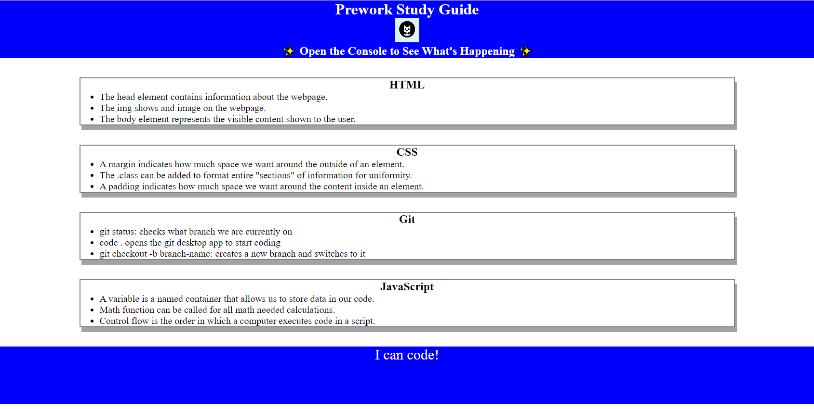

# Prework Study Guid Webpage

## Description

I want to expand my skillset as a Game Designer and have chosen to learn new coding languages to fulfill that goal.  I built this project in order to understand the basics before diving deeper into webpage creation. This project allowed me to learn how to use Git, VS Code, and three different coding languages in a basic manner.

## Installation

N/A

## Usage

This project can be used to learn the basics of webpage creation.  It has basic lessons that can be learned from HTML, CSS, and Javascript.
The javascript can be viewed to learn beginner loops and how to use the Math function.

## Credits

N/A

## License

MIT License

---
